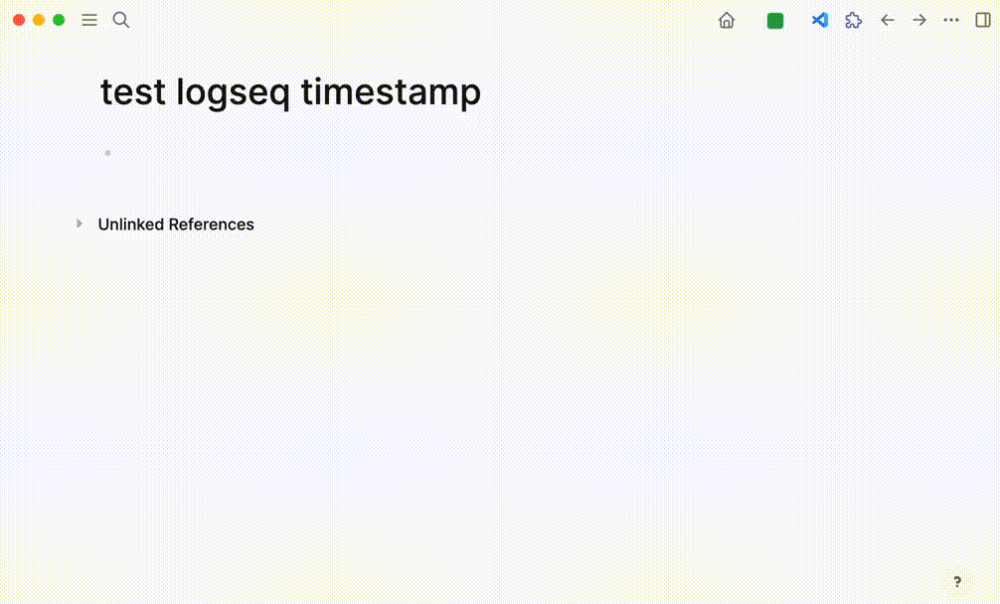

## logseq-timestamp

This is a plugin for [Logseq](https://logseq.com) that allows you to insert a timestamp in the editor.

### Demo

### Usage

- `Alt + Shift + D` to insert a timestamp in the editor.
- select format from open settings.(support toLocaleString, toUTCString, toISOString)

### Running the Sample

- `Load unpacked plugin` in Logseq Desktop client.
